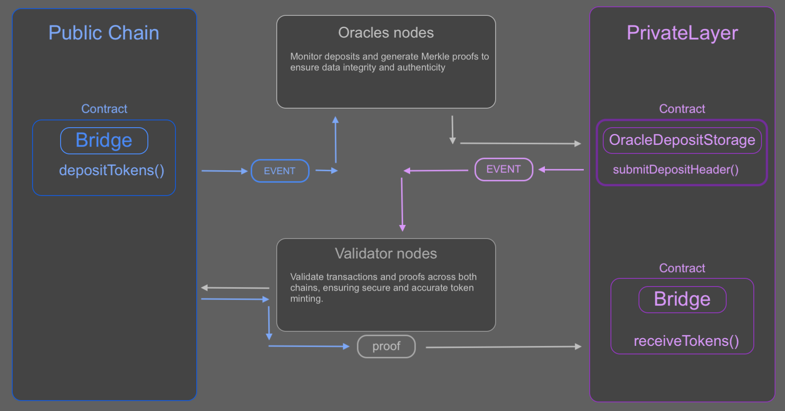

### PrivateLayer protocol

### Project Description: PrivateLayer L3 Blockchain with Native Bridge

The project aims to provide a secure, private, and isolated environment for executing transactions and managing assets, ensuring privacy and security through multiple validation and verification layers. This environment leverages the power and security of public blockchains while remaining isolated from the public. 

An additional private Layer 3 (L3) enhances this environment by enabling nearly free transaction execution. The native tokens of this private chain can be airdropped to users at no cost, making the chain operations highly attractive. Existing on-chain protocols, such as Uniswap, can be easily deployed and utilized on the private chain.

Users have the ability to bridge their tokens or stablecoins to the private chain. During this process, the tokens are locked on the destination chain, and an equivalent amount is minted on the private chain for the user. Users can send, stake, or trade these tokens within the private chain. When they are done, they can withdraw the tokens they hold at that moment without requiring additional recalculations to unlock the tokens on the destination chain. 

This mechanism ensures seamless integration and operation while maintaining high levels of security, privacy, and user convenience.

The PrivateLayer protocol facilitates the seamless deployment of private (L3) blockchains, complete with a native bridge enabling connection to any EVM-compatible chain, customizable infrastructure and nodes. These L3 chains offer extensive flexibility, allowing the configuration of custom consensus mechanisms and node settings. Currently, PrivateLayer supports two network options for deployment: Orbit by Arbitrum and Avalanche Subnets by Avalanche. The project includes a native bridge for seamless token transfers between Chain A (public network) and Chain B (private network).

#### A very basic diagram illustrating the bridging process steps and components involved when moving from a public chain to a private chain. When bridging from a private chain to a public chain, the reverse logic is applied.

#### Key Features:

1. **Dual-Chain Architecture**:
   - **Chain A**: Public network (e.g., Arbitrum or Avalanche).
   - **Chain B**: Private network (Orbit Network or Avalanche Subnet).
   -> Tokens are deposited on Chain A and minted on Chain B after validation.
   <- Tokens are burned on Chain B and released on Chain A after validation.

2. **Token Bridge Mechanism**:
   - **Deposit Process**: Tokens are locked on the public network (Chain A). The contract on Chain A emits an event about the deposit. Oracle nodes observe this event, create a Merkle root, and submit this deposit transaction to the deposit storage contract on Chain B.
   - **Storage and Notification**: The storage contract on Chain B emits the `DepositHeaderSubmitted` event, indicating that a new deposit has been stored.
   - **Validation and Minting**: Validators see the `DepositHeaderSubmitted` event, retrieve the transaction data from Chain A, generate proof, and call the bridge on Chain B with the data from the transaction on Chain A. The bridge on Chain B validates this transaction proof and mints the tokens if all validations are successful.

3. **Security and Privacy**:
   - **Oracle Nodes**: Monitor deposits and generate Merkle proofs to ensure data integrity and authenticity.
   - **Validator Nodes**: Validate transactions and proofs across both chains, ensuring secure and accurate token minting and burning.
   - **Merkle Proofs**: Used to verify transaction data, enhancing security by ensuring that all data is correctly validated before minting or burning tokens.

4. **Smart Contracts**:
   - **Bridge Contract**: Manages deposits, withdrawals, and token transfers between chains.
   - **OracleDepositStorage**: Stores Oracle submissions and manages Merkle proofs.
   - **ERC20Handler**: Handles token operations, including deposits, withdrawals, and resource management.

5. **Decentralized Validation**:
   - Validators on both chains work independently to verify transactions, ensuring decentralization and reducing the risk of single points of failure.
   - The threshold for validation (77%) ensures a high level of consensus before any transaction is processed.

6. **Technical Stack**:
   - **Solidity**: Smart contract development.
   - **OpenZeppelin**: Security and standard libraries.
   - **Hardhat**: Development environment and deployment.
   - **Ethers.js**: Interaction with Ethereum nodes.
   - **MerkleTree.js**: Generation and verification of Merkle proofs.
